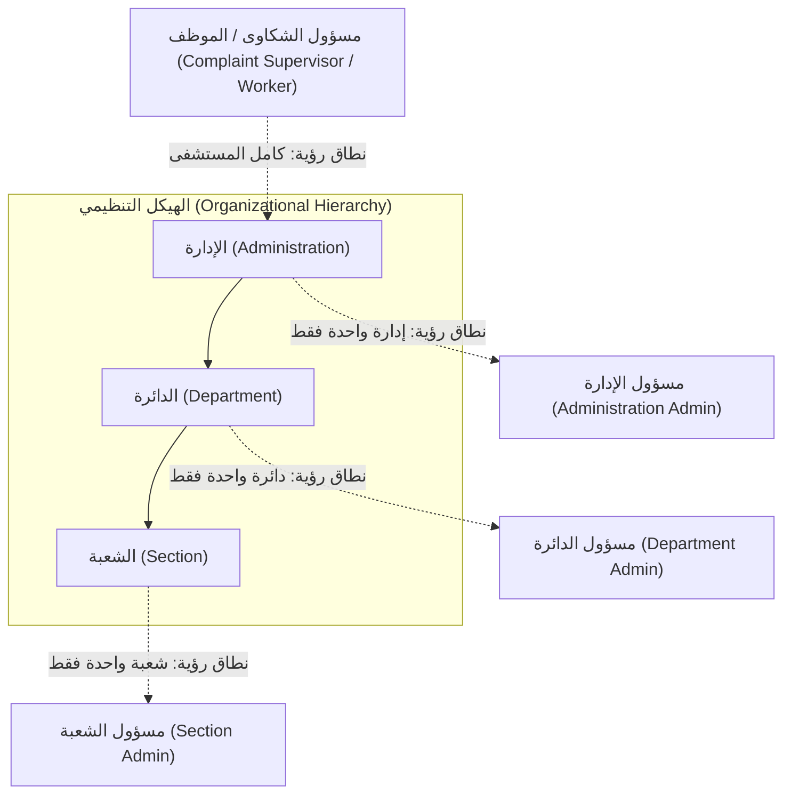
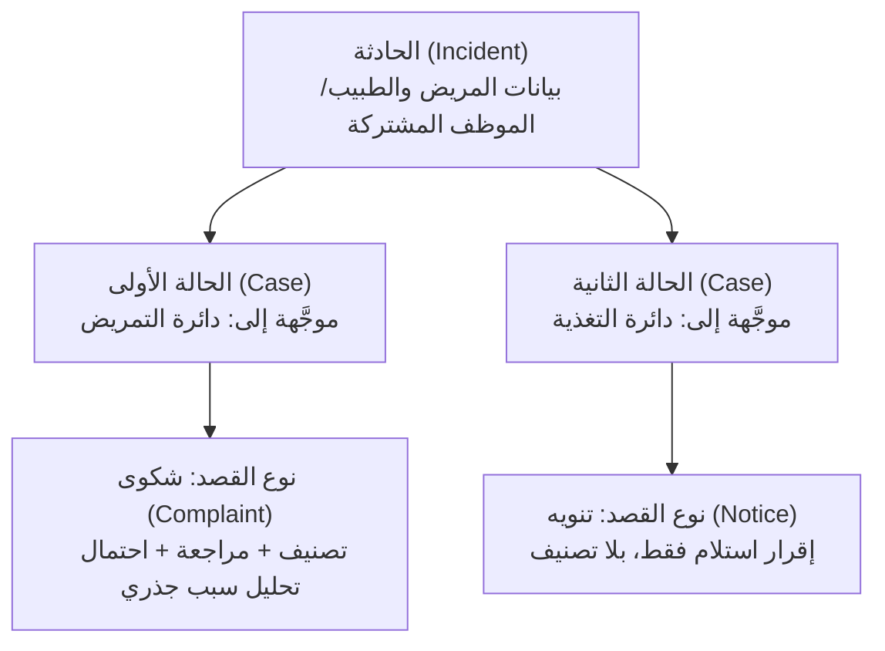
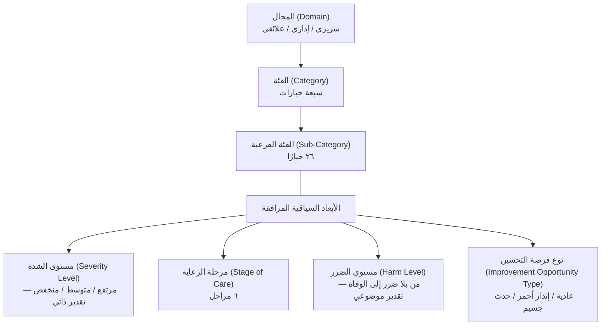
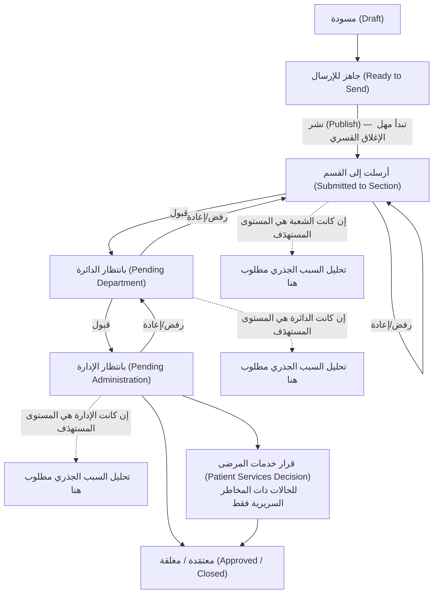
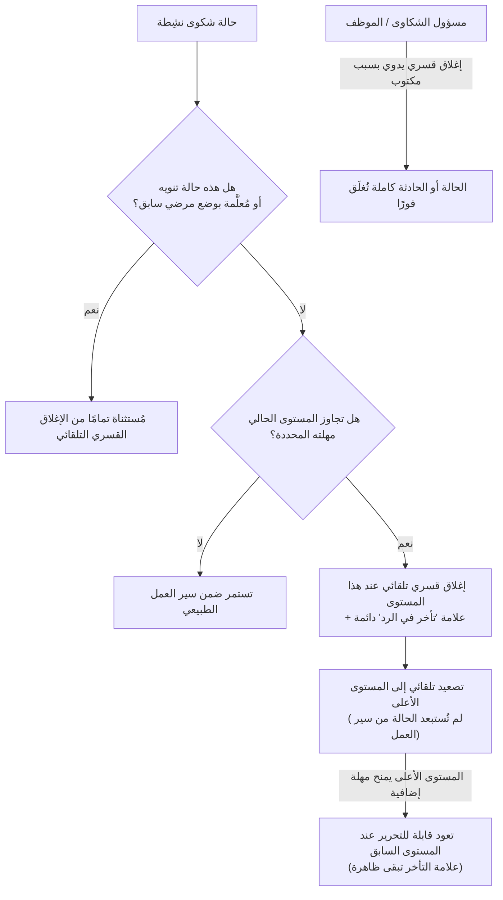
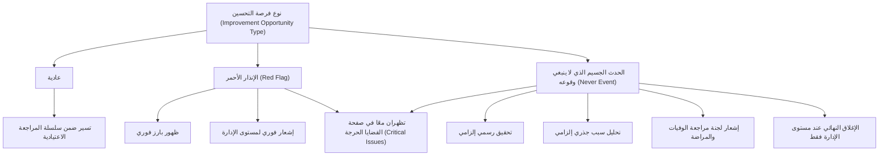
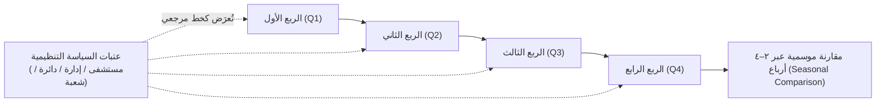
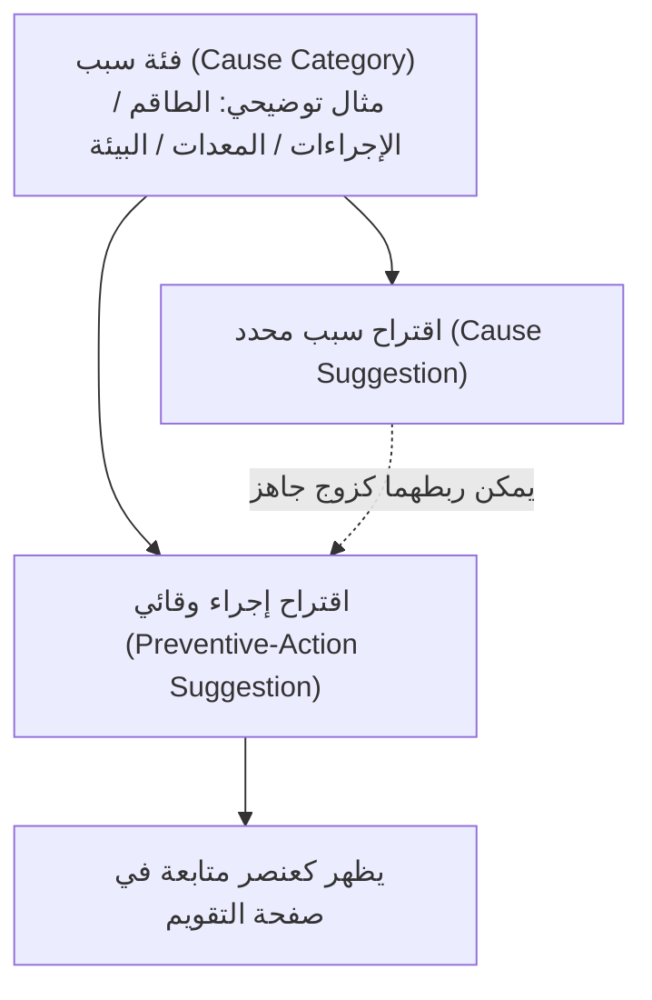
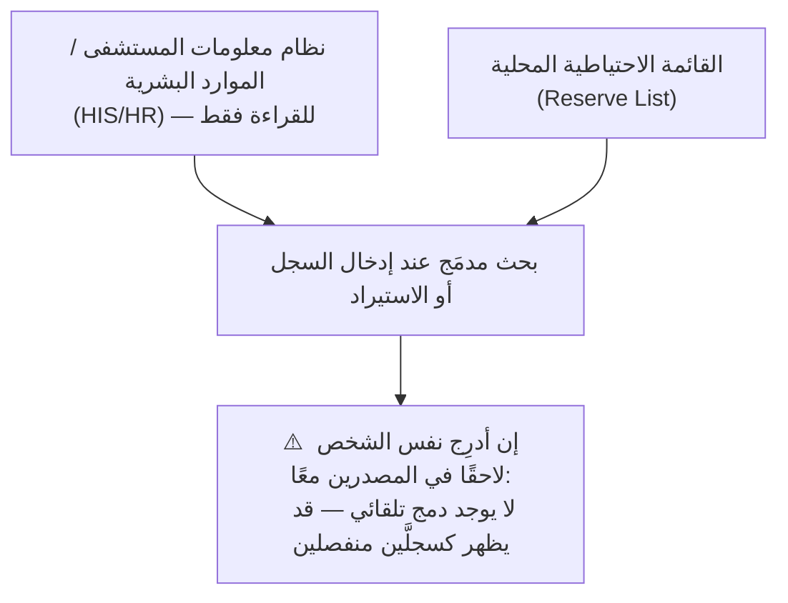

\[لقطة شاشة مطلوبة: صفحة تسجيل الدخول، لإظهار الاسم الحالي للنظام كما يظهر على المستخدم]

# دليل مسؤول نظام PEMS — الجزء الأول: المفاهيم الأساسية

### نظام إدارة تجربة المريض (Patient Experience Management System – PEMS)

---

## قبل أن تبدأ

هذا الدليل مخصص لك بصفتك **مسؤول الشكاوى (Complaint Supervisor)** — الدور الذي يملك صلاحية كاملة على النظام: كل الصفحات، وكل تبويبات الإعدادات، والقدرة على التصرّف نيابةً عن أي مستوى إداري عند الحاجة.

هذا الجزء لا يشرح كيف تضغط الأزرار — ذلك موضوع **الجزء الثاني: الوظائف حسب كل صفحة**، الذي سيصدر لاحقًا بعد مراجعتك لهذا الجزء. الهدف هنا مختلف: أن تفهم *لماذا* يعمل النظام بالطريقة التي يعمل بها، بحيث تصبح كل شاشة تراها لاحقًا منطقية من أول وهلة، بدلًا من أن تبدو مجموعة أزرار غير مترابطة.

### كيف تُقرأ المصطلحات في هذا الدليل

كل مصطلح رسمي في PEMS مكتوب بالعربية أولًا، يليه مباشرة الاسم الإنجليزي الرسمي بين قوسين، هكذا: **الحادثة (Incident)**. هذا ليس ترجمة تقريبية — إنه المصطلح الذي تراه فعليًا في واجهة النظام وفي تقاريره، وهو ما ستحتاج إلى استخدامه عند التواصل مع فريق الدعم الفني أو عند قراءة تقرير مُصدَّر. تمسّك بهذه الأسماء بدقة.

بعض الفقرات في هذا الدليل موسومة بعبارة **"قيد التحقق"** — وهذا يعني أن المعلومة لم تُؤكَّد بشكل مباشر من الشاشة الحيّة وقت كتابة هذا الدليل، وأنها بحاجة إلى تأكيد قبل اعتماد الدليل بشكل نهائي. تم تقليل هذه الحالات إلى أدنى حد ممكن بعد التحقق المباشر من النظام، ولن تجد أي معلومة أساسية معلّقة.

---

## 1. الأدوار والهيكل التنظيمي (Roles & the Organizational Hierarchy)

### 1.1 تعريف المفهوم

كل مستخدم في PEMS له **دور (Role)** واحد أو أكثر، وكل دور مرتبط بموضع محدد داخل الشجرة التنظيمية للمستشفى. الشجرة التنظيمية نفسها مكوّنة من ثلاثة مستويات:

**الإدارة (Administration) ← الدائرة أو القسم الإداري (Department) ← الوحدة أو الشعبة (Section)**

كل شكوى أو تنويه يُوجَّه في النهاية إلى أحد هذه المستويات — غالبًا الشعبة — وكل حساب مستخدم يرى فقط ما يخص موقعه في هذه الشجرة (وما يقع تحته).

### 1.2 لماذا يحتاج المسؤول إلى فهمه؟

بصفتك مسؤول الشكاوى، أنت من يُنشئ حسابات المستخدمين ويحدد أدوارهم. فهم هذا الهيكل ليس اختياريًا: أي خطأ في تعيين الدور أو النطاق التنظيمي يعني إما أن رئيس دائرة لا يستطيع رؤية صندوق الوارد الخاص بدائرته، أو — وهو الأخطر — أن مستخدمًا يرى بيانات شعبة أو دائرة لا علاقة له بها.

### 1.3 كيف يعمل داخل PEMS؟

النظام يحتوي حاليًا على خمسة أدوار فعلية:

| الدور | من هو؟ | نطاق الرؤية | الصفحات المتاحة |
|---|---|---|---|
| **مسؤول الشكاوى (Complaint Supervisor)** | المسؤول التنفيذي عن مكتب الشكاوى — أنت | كامل المستشفى | جميع الصفحات، وجميع تبويبات الإعدادات |
| **الموظف (Worker)** | موظفو الاستقبال والفرز اليومي للشكاوى | كامل المستشفى | نفس صفحات مسؤول الشكاوى تقريبًا، باستثناء أن الإعدادات تقتصر له على تبويبَي الأطباء والمرضى فقط |
| **مسؤول الشعبة (Section Admin)** | رئيس شعبة واحدة | تلك الشعبة فقط | لوحة المعلومات، صندوق الوارد، التقويم، صفحة سير العمل، تحليل الاتجاهات، العرض الجدولي، القضايا الحرجة — **بلا** إعدادات أو تقارير أو إدخال سجلات |
| **مسؤول الدائرة (Department Admin)** | رئيس دائرة كاملة | تلك الدائرة وكل ما تحتها من شُعَب | نفس نطاق مسؤول الشعبة، لكن على مستوى الدائرة بأكملها |
| **مسؤول الإدارة (Administration Admin)** | رئيس إدارة كاملة | تلك الإدارة وكل ما تحتها | نفس النطاق المحدود، على مستوى الإدارة بأكملها |

**ملاحظة تسمية مهمة:** كلمة "مسؤول" في أسماء الأدوار الثلاثة الأخيرة قد تُوحي بأنها أدوار قوية — لكن العكس هو الصحيح. هذه هي الأدوار **الأكثر تقييدًا** في النظام: عمل يومي على مستوى سير العمل فقط، بلا أي صلاحية إعدادات أو تكوين. الصلاحية الحقيقية الواسعة موجودة عند مسؤول الشكاوى والموظف، رغم أن اسميهما لا يحملان كلمة "مسؤول قسم" أو ما شابه.

> **ملاحظة داخلية للمُحرِّر (لا تُنشر في النسخة النهائية للمستخدم):** كان يوجد سابقًا دور سادس أعلى من مسؤول الشكاوى، لكنه أُلغي من الاستخدام الفعلي ولم يعد مُسنَدًا لأي حساب حاليًا؛ لذلك استُبعد بالكامل من هذا الدليل بناءً على توجيه صريح، وأصبح مسؤول الشكاوى هو أعلى دور فعلي يحتاج المستخدم لمعرفته.

### 1.4 علاقته بالمفاهيم الأخرى

هذا المفهوم هو الأساس الذي يبني عليه كل شيء آخر في هذا الدليل: نطاق كل تقرير (القسم 7)، ومن يملك صلاحية الإغلاق القسري (القسم 5)، ومن يستطيع رؤية حالة معينة أصلًا، كلها محكومة بموضع المستخدم داخل هذه الشجرة.

### 1.5 أثره على سير العمل أو التقارير

كل الصفحات التحليلية (لوحة المعلومات، التحقيق، تحليل الاتجاهات، التقارير) تحتوي على مرشِّح نطاق (Scope Filter) يتيح لك أنت — بصفتك تملك رؤية كاملة — التبديل بين رؤية المستشفى كاملًا، أو إدارة واحدة، أو دائرة واحدة، أو شعبة واحدة. أما المستخدمون محدودو النطاق فلا يرون هذا الخيار أصلًا؛ نطاقهم مُقفل تلقائيًا على موضعهم التنظيمي.

### 1.6 مثال واقعي من بيئة المستشفى

افترض أنك أنشأت حسابًا جديدًا لرئيسة قسم التمريض في دائرة الرعاية الحرجة، لكنك أسندت لها بالخطأ دور **مسؤول الإدارة (Administration Admin)** بدلًا من **مسؤول الدائرة (Department Admin)**. النتيجة: ستتمكن من رؤية شكاوى دوائر أخرى لا علاقة لها بعملها — وهذا تجاوز غير مقصود لخصوصية البيانات، وليس مجرد خطأ تقني بسيط.

### 1.7 خطأ أو سوء فهم شائع

الافتراض بأن اسم الدور يعكس مستوى الصلاحية. كما رأيت أعلاه، "مسؤول الشعبة" هو الدور الأكثر تقييدًا وليس الأقوى. عند إسناد الأدوار، اعتمد دائمًا على الجدول أعلاه، لا على الاسم وحده.

### 1.8 رسم توضيحي مناسب

### 1.9 الصفحات المرتبطة به

الإعدادات ← تبويب المستخدمين (إسناد الأدوار)؛ ويظهر أثر هذا المفهوم عمليًا في مرشِّح النطاق بكل من لوحة المعلومات، التحقيق، تحليل الاتجاهات، والتقارير.

---

## 2. الحادثة والحالات: أنواع الشكوى والتنويه (Incident → Cases, with Complaint and Notice Case Types)

### 2.1 تعريف المفهوم

**الحادثة (Incident)** هي الواقعة الواحدة التي يبلغ عنها المريض أو ذووه، وتحتوي على كل ما هو مشترك ولا يتغيّر بغض النظر عن عدد الجهات المعنية: بيانات المريض، والطبيب أو الموظف المعني، وتفاصيل المُبلِّغ.

تحت الحادثة الواحدة، يمكن أن توجد **حالة واحدة أو أكثر (Cases)**. كل حالة تستهدف دائرة واحدة بالتحديد — فإذا كان بلاغ المُبلِّغ يخص التمريض والصيدلية معًا، فهذه حادثة واحدة تحتوي على حالتين، تُتابَع كل واحدة منهما بشكل مستقل.

لكل حالة **نوع** يُحدَّد بحسب **نوع القصد من التغذية الراجعة (Feedback Intent Type)**:

- **الشكوى (Complaint)** — بلاغ سلبي. هذا هو النوع الكامل الوزن: يخضع للتصنيف (القسم 3)، ويمر بسلسلة المراجعة الكاملة (القسم 4)، وقد يتطلب تحليل السبب الجذري، ويخضع لمهل الإغلاق القسري (القسم 5).
- **التنويه (Notice)** — تعليق إيجابي أو محايد. هذا النوع مُصمَّم عمدًا ليكون خفيفًا: بلا تصنيف، وبلا تحليل سبب جذري، وبلا مهل إغلاق قسري. يكفي أن تطّلع عليه الدائرة المعنية وتُقرّ باستلامه، دون تحقيق.

يمكن أن تحتوي الحادثة الواحدة على حالة شكوى وحالة تنويه في آنٍ واحد — مثال: مُتصل يُثني على فريق التمريض بينما يشتكي في الوقت نفسه من تأخر في الفوترة.

### 2.2 لماذا يحتاج المسؤول إلى فهمه؟

عند إدخال أو مراجعة سجل، سترى غالبًا "حادثة" تحتوي على أكثر من "حالة". إن لم تفهم أن هذه الحالات مرتبطة ببعضها ولكنها تُتابَع بشكل مستقل، ستفسّر تقدّم إحدى الحالات على أنه تقدّم للحادثة كاملة — وهو خطأ شائع عند القراءة السريعة لصندوق الوارد أو العرض الجدولي.

### 2.3 كيف يعمل داخل PEMS؟

عمليًا، كل حالة تُتابَع داخليًا عبر سجل يحمل حالتها الخاصة في سلسلة المراجعة (القسم 4). لن ترى مصطلح هذا السجل الداخلي في الواجهة مباشرة، لكن من المفيد أن تعرف أن "الحالة" التي تراها في الشاشة و"مسار سير العمل" الذي يتغيّر تدريجيًا هما في الواقع الشيء نفسه من زاويتين مختلفتين.

### 2.4 علاقته بالمفاهيم الأخرى

هذا المفهوم هو الأساس الذي يُبنى عليه التصنيف (القسم 3) — فالتصنيف يُطبَّق على حالة الشكوى، لا على الحادثة ككل ولا على حالة التنويه. وهو أيضًا ما يحدد ما إذا كانت قواعد الإغلاق القسري التلقائي (القسم 5) تنطبق أصلًا.

### 2.5 أثره على سير العمل أو التقارير

عند تصدير تقرير أو عدّ الشكاوى، تأكد من أنك تعدّ **الحالات (Cases)**، لا **الحوادث (Incidents)** — فحادثة واحدة قد تحتوي على أكثر من حالة، وحساب الحوادث فقط قد يُخفي العدد الحقيقي للبلاغات الموزَّعة على الدوائر.

### 2.6 مثال واقعي من بيئة المستشفى

مريض يشتكي من تأخر استجابة الممرضات في العنبر، ويشتكي في الوقت نفسه من رداءة الطعام المُقدَّم. هذه حادثة واحدة تحتوي على حالتَي شكوى: واحدة موجَّهة إلى دائرة التمريض، وأخرى إلى دائرة التغذية — تتقدّم كل منهما في مسارها الخاص، وقد تُغلَق إحداهما قبل الأخرى بوقت طويل.

### 2.7 خطأ أو سوء فهم شائع

افتراض أن إغلاق حالة واحدة يعني إغلاق الحادثة بأكملها. هذا غير صحيح إلا إذا استُخدم الإغلاق القسري على مستوى الحادثة كاملة (انظر القسم 5) — فكل حالة تُغلَق بشكل مستقل عادةً.

### 2.8 رسم توضيحي مناسب

### 2.9 الصفحات المرتبطة به

إدخال سجل جديد، تعديل السجل، صندوق الوارد، العرض الجدولي.

---

## 3. تصنيف HCAT (HCAT Taxonomy)

### 3.1 تعريف المفهوم

كل حالة من نوع **شكوى (Complaint)** — وليس التنويه — تُصنَّف عند إنشائها عبر عدة أبعاد متكاملة، تُعرف مجتمعة باسم **تصنيف HCAT (HCAT Taxonomy)**:

**شجرة التصنيف الأساسية** (كل مستوى يُضيّق ما فوقه):
- **المجال (Domain)** — ثلاثة خيارات: سريري (Clinical)، إداري (Management)، علائقي (Relational)
- **الفئة (Category)** — سبعة خيارات، كل فئة تنتمي إلى مجال واحد
- **الفئة الفرعية (Sub-Category)** — ستة وعشرون خيارًا، كل فئة فرعية تنتمي إلى فئة واحدة

**الأبعاد السياقية**، تُسجَّل إلى جانب الشجرة أعلاه:
- **مستوى الشدة (Severity Level)** — مرتفع، متوسط، أو منخفض. هذا تقدير **ذاتي** — انطباع موظف الاستقبال عن مدى إلحاح الحالة، وليس نتيجة قياس فعلي.
- **مرحلة الرعاية (Stage of Care)** — إحدى ست مراحل: القبول (Admissions)، الفحص والتشخيص (Examination & Diagnosis)، الرعاية داخل العنبر (Care on the Ward)، العملية أو الإجراء (Operation/Procedure)، الخروج أو النقل (Discharge/Transfer)، أو غير محدد (Unspecified).
- **مستوى الضرر (Harm Level)** — مقياس من خمس درجات يبدأ من "بلا ضرر" وينتهي بـ"الوفاة". هذا تقدير **موضوعي** — النتيجة السريرية الفعلية — وهو حقل منفصل عمدًا عن مستوى الشدة. قد تُصنَّف حالة بأنها مرتفعة الشدة (تحتاج اهتمامًا عاجلًا) رغم أن مستوى الضرر فيها "بلا ضرر"، والعكس صحيح أيضًا.
- **نوع فرصة التحسين (Improvement Opportunity Type)** — عادية، أو إنذار أحمر (Red Flag)، أو حدث جسيم لا ينبغي وقوعه (Never Event). هذا الحقل لا يُستخدم للتصنيف فقط — إنه يُحدِّد مسار توجيه الحالة فعليًا (انظر القسم 6).

### 3.2 لماذا يحتاج المسؤول إلى فهمه؟

كل تقرير تحليلي في النظام — لوحة المعلومات، التحقيق، تحليل الاتجاهات، التقارير الموسمية — يُبنى على هذه الأبعاد السبعة. بدون فهمها، ستقرأ الرسوم البيانية كأرقام مجردة دون أن تفهم ما تعنيه فعليًا، ولن تتمكن من ضبط عتبات السياسات التنظيمية (القسم 7) بشكل صحيح.

### 3.3 كيف يعمل داخل PEMS؟

عند إدخال حالة شكوى جديدة، يقترح النظام تلقائيًا قيمًا لمعظم هذه الأبعاد اعتمادًا على نص الشكوى، بالاستعانة بنماذج ذكاء اصطناعي مدرَّبة. يراجع موظف الاستقبال هذه الاقتراحات ويمكنه قبولها، أو تعديلها، أو رفضها تمامًا قبل تأكيد الحالة. تتفاوت دقة الاقتراح بين الأبعاد — اقتراح **المجال (Domain)** عادة ما يكون موثوقًا، بينما **مستوى الضرر (Harm Level)** هو الأصعب على النموذج تحديده بدقة. ما يُؤكِّده الموظف في النهاية هو السجل الرسمي المعتمَد، ويُستخدم أيضًا لاحقًا لتحسين دقة اقتراحات النموذج في المستقبل.

### 3.4 علاقته بالمفاهيم الأخرى

**نوع فرصة التحسين (Improvement Opportunity Type)** يربط هذا القسم مباشرة بالقسم 6 (الإنذار الأحمر والحدث الجسيم). و**مستوى الشدة (Severity Level)** و**المجال (Domain)** هما ما تُبنى عليه عتبات السياسات التنظيمية في القسم 7.

### 3.5 أثره على سير العمل أو التقارير

عتبات السياسات (القسم 7) تُحسَب اعتمادًا مباشرًا على هذه الأبعاد — على سبيل المثال، نسبة الحالات ذات الشدة المرتفعة ضمن المجال السريري. أي خطأ متكرر في التصنيف عند الإدخال ينعكس مباشرة على دقة هذه المؤشرات لاحقًا.

### 3.6 مثال واقعي من بيئة المستشفى

شكوى بشأن تأخر تلقّي مسكِّن للألم بعد عملية جراحية: **المجال** سريري، **الفئة الفرعية** قد تخص التعامل مع الألم بعد العملية، **مرحلة الرعاية** هي "العملية أو الإجراء"، **مستوى الشدة** قد يُقيَّم "مرتفع" لأن المريض تألم فعليًا، بينما **مستوى الضرر** قد يبقى "بلا ضرر" إن لم تنتج عن التأخير أي مضاعفات سريرية دائمة.

### 3.7 خطأ أو سوء فهم شائع

الخلط بين **مستوى الشدة (Severity Level)** و**مستوى الضرر (Harm Level)** باعتبارهما الشيء نفسه. هما بُعدان منفصلان تمامًا: الأول انطباع لحظي عن الإلحاح، والثاني نتيجة سريرية فعلية موثَّقة. القبول باقتراح الذكاء الاصطناعي دون مراجعة — خصوصًا في **مستوى الضرر** — خطأ شائع آخر، نظرًا إلى تفاوت دقة النموذج بين الأبعاد.

### 3.8 رسم توضيحي مناسب

### 3.9 الصفحات المرتبطة به

إدخال سجل جديد، تعديل السجل، الإعدادات ← تبويب إدارة التصنيفات، لوحة المعلومات، تحليل الاتجاهات.

---

## 4. دورة حياة سير العمل والحالات (Workflow Lifecycle & Statuses)

### 4.1 تعريف المفهوم

هذا القسم يشرح ما يحدث لحالة الشكوى من لحظة إنشائها حتى إغلاقها — وهو العمود الفقري لصندوق الوارد وصفحة سير العمل.

### 4.2 لماذا يحتاج المسؤول إلى فهمه؟

فهم هذه الدورة هو ما يمكّنك من الإجابة فورًا عن سؤال "أين هذه الحالة الآن، ومن المسؤول عن التصرف فيها؟" — وهو السؤال الأكثر تكرارًا في عمل مكتب الشكاوى اليومي.

### 4.3 كيف يعمل داخل PEMS؟

**قبل الدخول في سير العمل:**
تبدأ الحادثة الجديدة بحالة **مسودة (Draft)** إن كان ينقصها بيانات مطلوبة، ثم تصبح **جاهزة للإرسال (Ready to Send)** عند اكتمالها. لا تظهر أي حادثة في حالة مسودة أو جاهزة للإرسال في صندوق وارد أي أحد — الإرسال دائمًا إجراء متعمَّد، وليس تلقائيًا أبدًا. عند الضغط على **نشر (Publish)**، تدخل الحالة سير العمل الفعلي، وهذه هي اللحظة التي تبدأ فيها مهل الإغلاق القسري بالعدّ (القسم 5).

**سلسلة المراجعة:**
تُوجَّه حالة الشكوى إلى المستوى الذي تستهدفه — غالبًا الشعبة أولًا، لكن يمكن أن تُوجَّه مباشرة إلى الدائرة أو الإدارة إن كان الأمر يخصها تحديدًا:

1. المستوى المستلِم إما **يقبل** الحالة (فتنتقل للأعلى) أو **يرفضها/يُعيدها** للمراجعة (فتعود للأسفل لاستكمال معلومات).
2. عند القبول، تتقدّم الحالة نحو المستوى التالي: **الشعبة ← الدائرة ← الإدارة**.
3. عند وصولها إلى المستوى الذي تستهدفه فعليًا (وهو ما يحدَّد بحسب الجهة المقصودة بالشكوى، وليس دائمًا الشعبة)، يصبح **تحليل السبب الجذري (Root Cause Analysis – RCA)** شرطًا إلزاميًا قبل اعتماد الحالة والمضي بها إلى الأمام.
   - إن كان التحليل ناقصًا أو غير مكتمل، لا يمكن للحالة أن تتقدّم — تبقى معلَّقة عند ذلك المستوى أو تُعاد للمراجعة.
   - القسم 8 يشرح بالتفصيل ما الذي يجب أن يتضمنه تحليل السبب الجذري فعليًا.
4. عند اعتمادها في نهاية السلسلة المطلوبة، تُصبح الحالة **معتمَدة/مغلقة**.

بعض الحالات — عادة تلك ذات المخاطر السريرية — تمر بخطوة إضافية بعد اعتماد الإدارة، تُعرف بـ **قرار خدمات المرضى (Patient Services Decision)**، حيث يُرفق رأي طبي رسمي مبني على مراجع علمية قبل اعتبار الحالة مغلقة نهائيًا. هذه الخطوة لا تنطبق على التنويهات. *(قيد التحقق: المسمّى الظاهر فعليًا على الشاشة لهذه الخطوة تغيّر أكثر من مرة في تاريخ تطوير النظام؛ يُنصح بتأكيد التسمية الحالية المعروضة للمستخدم قبل اعتماد هذا الدليل نهائيًا.)*

الحالة المرفوضة من الشعبة يمكن لك، بصفتك مسؤول الشكاوى، **إعادة فتحها** إن كانت رُفضت وتحتاج مراجعة أخرى.

**الحالات التي سترى مسمّياتها فعليًا:**
النظام لا يكتفي بثلاث حالات بسيطة (مفتوحة / قيد التنفيذ / مغلقة) — بل يُسجّل بدقة أين توجد الحالة وماذا حدث لها لتوّه: **أُرسلت إلى القسم (Submitted to Section)**، مقبولة وبانتظار الدائرة، مُعادة للمراجعة، بانتظار قرار خدمات المرضى، معتمَدة، مرفوضة، أو إحدى حالات الإغلاق القسري (القسم 5). إن رأيت في أحد التقارير أو الملفات المُصدَّرة تصنيفًا مبسَّطًا بثلاث حالات فقط، فاعلم أنه تلخيص لأغراض التقرير — والسجل الفعلي أدق من ذلك بكثير.

التنويهات تتجاوز كل هذا تقريبًا — تنتقل مباشرة إلى حالة "تم الاطّلاع عليها" بمجرد أن تراها الدائرة المعنية، دون تصنيف ودون سلسلة اعتماد ودون تحليل سبب جذري.

### 4.4 علاقته بالمفاهيم الأخرى

هذا القسم هو نقطة الالتقاء بين كل المفاهيم الأخرى: الهيكل التنظيمي (القسم 1) يحدد من يتصرف عند كل مستوى، والتصنيف (القسم 3) يحدد المستوى المستهدَف فعليًا، وتحليل السبب الجذري (القسم 8) يتحكم في إمكانية التقدّم، والإغلاق القسري (القسم 5) هو ما يحدث حين لا يتحرك أحد.

### 4.5 أثره على سير العمل أو التقارير

مدة بقاء الحالة عند كل مستوى — وليس فقط حالتها النهائية — هي ما يُستخدم لقياس الأداء التنظيمي والالتزام بالمهل، ويظهر ذلك في تقارير النشاط وصفحة التقويم.

### 4.6 مثال واقعي من بيئة المستشفى

شكوى تخص جودة الطعام في الجناح: تُرسَل إلى دائرة التغذية، تقبلها الدائرة، ولأن التصنيف حدَّد أنها تستهدف الدائرة تحديدًا (وليس الإدارة)، يصبح تحليل السبب الجذري مطلوبًا هناك مباشرة قبل الاعتماد — لا يُنتظر وصولها إلى الإدارة أولًا.

### 4.7 خطأ أو سوء فهم شائع

افتراض أن تحليل السبب الجذري مطلوب دائمًا عند الشعبة فقط. في الواقع، هو مطلوب عند **المستوى الذي تستهدفه الحالة فعليًا** — وقد يكون ذلك الدائرة أو الإدارة مباشرة، بحسب طبيعة الشكوى.

### 4.8 رسم توضيحي مناسب

### 4.9 الصفحات المرتبطة به

صندوق الوارد، صفحة سير العمل، التقويم، إدخال سجل جديد.

---

## 5. الإغلاق القسري — اليدوي والتلقائي (Force Close — Manual and Automatic)

### 5.1 تعريف المفهوم

**الإغلاق القسري (Force Close)** يعني إنهاء دورة المراجعة الطبيعية لحالة ما قبل أن تكتمل بالطريقة المعتادة. يوجد أسلوبان منفصلان تمامًا لحدوث ذلك.

### 5.2 لماذا يحتاج المسؤول إلى فهمه؟

أنت من يضبط مهل الإغلاق القسري التلقائي، وأنت من يملك صلاحية استخدام الإغلاق اليدوي. سوء فهم الفرق بين الاثنين يؤدي إلى قرارات خاطئة: إما إغلاق حالة يدويًا كان يمكن تركها لتنتهي طبيعيًا، أو ضبط مهلة قصيرة جدًا تُغلق حالات فعلية لم يُتَح لأصحابها وقت كافٍ للرد.

### 5.3 كيف يعمل داخل PEMS؟

**الإغلاق القسري اليدوي:**
يمكنك (أو الموظف) إغلاق:
- **حالة واحدة فقط**، أو
- **حادثة كاملة** (ما يُغلق جميع الحالات التابعة لها دفعة واحدة)

في كلتا الحالتين، يجب كتابة سبب (بحد أدنى عشرة أحرف) — ويُسجَّل هذا السبب دائمًا. استخدم هذا الخيار حين تحتاج حالة فعلًا إلى إخراجها يدويًا من المسار الطبيعي.

**الإغلاق القسري التلقائي:**
هذه سياسة تعمل من تلقاء نفسها، دون أي تدخل بشري:

- لكل مستوى في سلسلة المراجعة (الشعبة، الدائرة، الإدارة) **مهلة زمنية** مقاسة بالأيام، تبدأ من لحظة نشر الحالة. القيم الافتراضية هي ١٠ أيام للشعبة، و٧ أيام لكل من الدائرة والإدارة — وهذه قيم **قابلة للتعديل**.
- يعمل فحص تلقائي في الخلفية (تقريبًا كل ساعة) للبحث عن أي حالة تجاوز مستواها الحالي مهلته.
- عند اكتشاف مثل هذه الحالة، تتحوّل حالة ذلك المستوى إلى حالة **إغلاق قسري تلقائي**، وتُسجَّل عليها **علامة "تأخر في الرد" دائمة**، والأهم — **لا تُستبعد الحالة من سير العمل**. بل تتصاعد تلقائيًا إلى المستوى الأعلى، تمامًا كما لو أنها قُبلت، ليتمكن المستوى التالي من التصرف فيها.
- **التنويهات والحالات ذات "الوضع المرضي المزمن أو الخطير السابق" (Morbidity) مُستثناة تمامًا.** أي حالة مُعلَّمة بأن المريض لديه وضع صحي خطير سابق لا تخضع أبدًا للإغلاق القسري التلقائي، بغض النظر عن مدة بقائها دون رد.
- **العكس — منح مهلة إضافية (Give More Time):** يستطيع من أصبح مسؤولًا عن الحالة الآن (المستوى الأعلى) إعادة تشغيل مهلة المستوى الذي تجاوز موعده، فتعود الحالة قابلة للتحرير عند ذلك المستوى مجددًا. تبقى علامة "تأخر في الرد" الدائمة ظاهرة على السجل حتى بعد هذا الإجراء — فهي أثر تاريخي، لا يُمحى.

### 5.4 علاقته بالمفاهيم الأخرى

الإغلاق القسري التلقائي يعتمد مباشرة على مفهوم **نوع القصد من التغذية الراجعة** (القسم 2) لاستثناء التنويهات، وعلى **الهيكل التنظيمي** (القسم 1) لتحديد المستوى التالي عند التصعيد.

### 5.5 أثره على سير العمل أو التقارير

نسبة الحالات التي حملت علامة "تأخر في الرد" ولو مرة واحدة هي مؤشر أداء تنظيمي مهم — تظهر في صندوق الوارد وتُستخدم لقياس التزام كل مستوى بالمهل المحددة له.

### 5.6 مثال واقعي من بيئة المستشفى

شكوى وُجِّهت إلى دائرة الصيانة ولم يستجب أحد لها خلال المهلة المحددة. يُغلقها النظام تلقائيًا عند مستوى الدائرة، ويصعِّدها تلقائيًا إلى الإدارة، مع علامة تأخر ظاهرة. لاحقًا، تكتشف الإدارة أن الدائرة كانت تنتظر معلومة إضافية من المريض ولم تُبلَّغ بها في الوقت المناسب، فتستخدم خيار "منح مهلة إضافية" لإعادة الحالة إلى الدائرة لإكمالها بشكل صحيح — مع بقاء أثر التأخر مسجَّلًا.

### 5.7 خطأ أو سوء فهم شائع

الاعتقاد بأن الإغلاق القسري — يدويًا كان أو تلقائيًا — يعني نهاية الحالة بشكل قاطع. في الحالة التلقائية تحديدًا، هذا غير صحيح إطلاقًا: الحالة تستمر في سير العمل عبر التصعيد التلقائي، ويمكن التراجع عنها بمنح مهلة إضافية.

### 5.8 رسم توضيحي مناسب

### 5.9 الصفحات المرتبطة به

صفحة سير العمل (الإغلاق اليدوي والتعبئة نيابةً عن المستخدم)، صندوق الوارد، الإعدادات ← تبويب سياسة الإغلاق القسري.

---

## 6. تصعيد الإنذار الأحمر والحدث الجسيم (Red Flag / Never Event Escalation)

### 6.1 تعريف المفهوم

حقل **نوع فرصة التحسين (Improvement Opportunity Type)**، المُحدَّد أثناء التصنيف (القسم 3)، قد يُصنِّف حالة الشكوى كأحد نوعين يستوجبان تصعيدًا خاصًا:

- **الإنذار الأحمر (Red Flag)** — حالة عاجلة تستوجب اهتمام الإدارة العليا فورًا.
- **الحدث الجسيم الذي لا ينبغي وقوعه (Never Event)** — حدث سريري خطير جدًا.

### 6.2 لماذا يحتاج المسؤول إلى فهمه؟

هذان النوعان لا يُعامَلان كالحالات العادية — تجاهل هذا الفرق يعني التعامل مع حدث خطير بنفس أولوية شكوى روتينية.

### 6.3 كيف يعمل داخل PEMS؟

**الإنذار الأحمر** يُظهَر بشكل بارز حتى لا يضيع وسط قائمة الحالات العادية، ويُرسِل إشعارًا فوريًا نحو مستوى الإدارة.

**الحدث الجسيم** يستوجب إجراءات أشد: تحقيقًا رسميًا إلزاميًا، وتحليل سبب جذري مكتمل إلزاميًا، وإشعارًا للجنة مراجعة الوفيات والمراضة (M&M Committee)، ولا يمكن اعتماده وإغلاقه رسميًا إلا عند مستوى الإدارة — لا يُغلَق أبدًا عند مستوى أدنى، خلافًا للحالات الاعتيادية.

كلا النوعين يظهران معًا في صفحة **القضايا الحرجة (Critical Issues)** بدلًا من وجودهما في صفحتين منفصلتين — هذه الصفحة هي مكانك الوحيد لرؤية كل ما هو مُصعَّد، بصرف النظر عن نوعه.

### 6.4 علاقته بالمفاهيم الأخرى

يعتمد هذا التصعيد على حقل من تصنيف HCAT (القسم 3)، ويفرض متطلبات إضافية على دورة سير العمل (القسم 4) — خصوصًا اشتراط إغلاق الحدث الجسيم عند الإدارة حصرًا.

### 6.5 أثره على سير العمل أو التقارير

عدد حالات الإنذار الأحمر والحدث الجسيم مؤشر رئيسي في لوحة المعلومات وصفحة التحقيق، ويُستخدم عادة كمقياس مباشر لجودة السلامة داخل المستشفى.

### 6.6 مثال واقعي من بيئة المستشفى

خطأ في إعطاء دواء أدى إلى مضاعفة صحية جسيمة لمريض. تُصنَّف الحالة كحدث جسيم؛ يُشعَر مستوى الإدارة فورًا، ويُفتح تحقيق رسمي، ويُشترط تحليل سبب جذري كامل قبل إمكانية إغلاق الحالة، ولا يمكن لأي مستوى أدنى من الإدارة إغلاقها مهما بلغت درجة اكتمال الرد لديه.

### 6.7 خطأ أو سوء فهم شائع

الافتراض بأن الإنذار الأحمر والحدث الجسيم لهما نفس درجة الخطورة والمعاملة. الحدث الجسيم أشد بكثير من حيث المتطلبات الإلزامية (تحقيق رسمي، تحليل سبب جذري إلزامي، وإغلاق حصري عند الإدارة)، بينما الإنذار الأحمر يعني أساسًا أولوية عاجلة في الاهتمام دون بالضرورة نفس القيود الصارمة.

### 6.8 رسم توضيحي مناسب

### 6.9 الصفحات المرتبطة به

القضايا الحرجة، لوحة المعلومات، التحقيق.

---

## 7. التقارير الموسمية وعتبات السياسات التنظيمية (Seasonal Reporting & Organizational Policy Thresholds)

### 7.1 تعريف المفهوم

يعمل نظام التقارير في PEMS على دورة ربع سنوية (الربع الأول إلى الرابع) إضافة إلى التقارير الشهرية. في نهاية كل ربع، يُولِّد النظام تلقائيًا إحصاءات "حالات الموسم" لكل دائرة.

كل وحدة تنظيمية — إدارة، أو دائرة، أو شعبة، بل والمستشفى ككل — يمكن أن يكون لها **عتبات سياسة (Policy Thresholds)** خاصة بها، قابلة للتهيئة، مثل:
- الحد الأقصى المقبول لنسبة الحالات ذات الشدة المرتفعة
- الحد الأقصى لنسبة كل مجال (سريري / إداري / علائقي)

### 7.2 لماذا يحتاج المسؤول إلى فهمه؟

أنت من يضبط هذه العتبات مباشرة عبر الإعدادات. عتبة مضبوطة بشكل غير واقعي — سواء متساهلة جدًا أو صارمة جدًا — تُفقد التقرير قيمته كأداة تنبيه مبكر.

### 7.3 كيف يعمل داخل PEMS؟

تُدار هذه العتبات من خلال أربع مجموعات منفصلة قابلة للتعديل كل على حدة: عتبات على مستوى المستشفى ككل (حدود لكل درجة شدة، وحدود لكل مجال)، وعتبات مستقلة على مستوى الشُّعَب، والدوائر، والإدارات (حدود لكل مجال في كل مستوى). كل مجموعة تُحفَظ وتُطبَّق بشكل مستقل عن الأخرى.

**مثال توضيحي (بيانات توضيحية وليست بيانات حقيقية):** إحدى القواعد المعتمَدة على مستوى المستشفى بأكمله هي أن نسبة الحالات التي تجمع بين **الشدة المرتفعة** و**المجال السريري** يجب ألا تتجاوز ٣٪ — وتُطبَّق هذه القاعدة تحديدًا على مستوى المستشفى ككل، لا على كل دائرة منفردة.

إلى جانب التقرير الموسمي الواحد، يمكنك تشغيل **مقارنة موسمية (Seasonal Comparison)** عبر ٢ أو ٣ أو ٤ أرباع متتالية لرصد الاتجاه عبر الزمن.

### 7.4 علاقته بالمفاهيم الأخرى

هذه العتبات تُحسَب مباشرة من أبعاد تصنيف HCAT (القسم 3: المجال، الشدة)، وتُطبَّق ضمن الهيكل التنظيمي (القسم 1).

### 7.5 أثره على سير العمل أو التقارير

تجاوز إحدى العتبات لا يُغلق أي حالة تلقائيًا ولا يُشعِر أحدًا بشكل فوري بذاته — بل يظهر كخط مرجعي على الرسوم البيانية في صفحة تحليل الاتجاهات، ليتيح لك أنت قراءة مدى الالتزام بصريًا بدلًا من مقارنة الأرقام يدويًا.

### 7.6 مثال واقعي من بيئة المستشفى

في نهاية الربع الثاني، تلاحظ من خلال خط العتبة في تحليل الاتجاهات أن نسبة الحالات الشديدة ضمن المجال السريري اقتربت من العتبة المحددة على مستوى المستشفى. هذا لا يعني وجود مشكلة قاطعة، لكنه إشارة تستحق مراجعة أعمق قبل أن تتجاوز النسبة الحد المسموح فعليًا.

### 7.7 خطأ أو سوء فهم شائع

الاعتقاد بأن تجاوز العتبة يُطلق تنبيهًا تلقائيًا أو يُحدث تصعيدًا فوريًا شبيهًا بالإنذار الأحمر. هذا غير صحيح — العتبات أداة قراءة وتحليل بصري في التقارير، وليست آلية تنبيه تلقائي.

### 7.8 رسم توضيحي مناسب

### 7.9 الصفحات المرتبطة به

تحليل الاتجاهات، التقارير، الإعدادات ← تبويب تهيئة السياسات.

---

## 8. إطار تحليل السبب الجذري (RCA Framework in Detail)

### 8.1 تعريف المفهوم

**تحليل السبب الجذري (Root Cause Analysis – RCA)** هو التفسير المنظَّم المطلوب قبل اعتماد حالة الشكوى وتجاوزها للمستوى الذي تستهدفه (انظر القسم 4 لمعرفة متى وأين يُشترط).

### 8.2 لماذا يحتاج المسؤول إلى فهمه؟

هذا الإطار ليس ثابتًا محفوظًا في برمجة النظام — بل هو **قابل للتهيئة بالكامل** من قبلك عبر الإعدادات: يمكنك إضافة فئات أسباب جديدة، وتعديل الأسباب المقترحة، وربط سبب معيّن باقتراح إجراء وقائي محدد، أو إلغاء تفعيل أي منها دون حذفه نهائيًا. هذا يعني أن القائمة الفعلية المعروضة للمستخدمين هي دائمًا ما تراه أنت حاليًا في تبويب اقتراحات تحليل السبب الجذري، لا قائمة ثابتة مطبوعة في هذا الدليل.

### 8.3 كيف يعمل داخل PEMS؟

يتكون الإطار من ثلاثة عناصر مترابطة:

1. **فئات الأسباب (Cause Categories)** — مجموعات تصنيفية عامة للسبب (على سبيل المثال، ما يخص الطاقم، أو الإجراءات، أو المعدات، أو البيئة — وهذه أمثلة على الفئات الشائعة، لا قائمة ثابتة مغلقة).
2. **اقتراحات الأسباب (Cause Suggestions)** — نصوص محددة أدق ضمن كل فئة، تصف سببًا فعليًا محتملاً.
3. **اقتراحات الإجراءات الوقائية (Preventive-Action Suggestions)** — نصوص تصف ما سيُتخذ لمنع تكرار المشكلة (على سبيل المثال: اجتماعات دورية، تدريب، زيادة عدد الطاقم، إحالة إلى لجنة مراجعة الوفيات والمراضة، أو إجراء آخر مخصَّص).

يمكن أيضًا **ربط سبب محدد بإجراء وقائي محدد** كزوج جاهز (Cause–Action Pair)، ليظهر للمستخدم اقتراح متكامل بدلًا من اختيار كل عنصر بشكل منفصل. جميع هذه العناصر تُكتب بالعربية والإنجليزية معًا داخل النظام نفسه.

### 8.4 علاقته بالمفاهيم الأخرى

هذا الإطار هو ما يحقق شرط "تحليل السبب الجذري" المذكور في دورة سير العمل (القسم 4) — فبدونه، لا يمكن لأي حالة شكوى تجاوز المستوى المستهدَف.

### 8.5 أثره على سير العمل أو التقارير

الإجراءات الوقائية الناتجة عن تحليل السبب الجذري تظهر كعناصر متابَعة في صفحة التقويم، بحيث يمكن تتبّع تنفيذها الفعلي لا مجرد اقتراحها على الورق. كما يُبنى عليها تقرير نشاط سير العمل الخاص بكل دائرة.

### 8.6 مثال واقعي من بيئة المستشفى

شكوى متكررة بشأن تأخر استجابة جرس الاستدعاء في أحد الأجنحة. يحدِّد تحليل السبب الجذري أن السبب يقع ضمن فئة "الطاقم" تحديدًا (نقص عدد الممرضات في الوردية المسائية)، ويُقترَن بإجراء وقائي من نوع "زيادة عدد الطاقم"، ويُسجَّل هذا الإجراء كعنصر متابعة بتاريخ استحقاق محدد في صفحة التقويم.

### 8.7 خطأ أو سوء فهم شائع

الاعتقاد بأن فئات الأسباب والإجراءات الوقائية قائمة ثابتة لا يمكن تعديلها. في الواقع هي قابلة للتخصيص الكامل من قِبلك، وقد لا تتطابق دائمًا مع أي مثال ثابت مذكور في هذا الدليل أو في أي وثيقة قديمة.

### 8.8 رسم توضيحي مناسب

### 8.9 الصفحات المرتبطة به

صفحة سير العمل (عند تعبئة تحليل السبب الجذري)، التقويم، الإعدادات ← تبويب اقتراحات تحليل السبب الجذري.

---

## 9. الربط المزدوج المصدر لسجلات الأطباء والموظفين (Doctor/Employee Dual-Source Linkage)

### 9.1 تعريف المفهوم

سجلات الأطباء والموظفين داخل PEMS تأتي من مصدرين في آن واحد:

1. **عرض للقراءة فقط من نظام المستشفى الأساسي (نظام معلومات المستشفى / الموارد البشرية — HIS/HR)** — المصدر الرسمي الذي لا يستطيع PEMS الكتابة فيه أو تعديله.
2. **قائمة احتياطية محلية (Reserve List)** داخل PEMS، لإدخال أشخاص لم يُدرَجوا بعد في نظام المستشفى الأساسي (مثل طبيب جديد لم تُستكمل إجراءات إدراجه رسميًا بعد).

### 9.2 لماذا يحتاج المسؤول إلى فهمه؟

هذا التفصيل التقني له أثر عملي مباشر: قد يظهر الطبيب نفسه كسجلَّين منفصلين دون أن يُخطرك النظام بذلك، فتتوزع شكاواه إحصائيًا بين سجلَّين بدلًا من سجل واحد.

### 9.3 كيف يعمل داخل PEMS؟

عند البحث عن طبيب أو موظف — أثناء إدخال سجل جديد أو أثناء استيراد بيانات دفعة واحدة — يبحث PEMS في المصدرين معًا ويعرض النتائج مدمَجة، دون الحاجة لأن تتحقق من مكانَين بنفسك.

**ما يجب الانتباه إليه:** إن وُجد شخص في القائمة الاحتياطية المحلية، ثم أُدرِج لاحقًا في نظام المستشفى الأساسي، **لا يكتشف PEMS ذلك تلقائيًا ولا يدمج السجلَّين**. لا توجد أداة دمج تلقائي مدمجة لهذه الحالة — يجب رصدها ومعالجتها يدويًا عند ملاحظتها (مثلًا أثناء مراجعة صفحة السجل التاريخي أو العرض الجدولي لطبيب معيّن ورؤية شكاواه موزَّعة على سجلَّين).

### 9.4 علاقته بالمفاهيم الأخرى

يظهر هذا المفهوم عمليًا أثناء إدخال السجل الجديد (القسم 2) وأثناء استيراد البيانات دفعة واحدة.

### 9.5 أثره على سير العمل أو التقارير

سجل مُنقسم بين مصدرين يعني إحصاءات غير دقيقة عند البحث عن تاريخ طبيب أو موظف معيّن — فبعض الشكاوى قد تظهر تحت السجل الاحتياطي وأخرى تحت السجل الرسمي، دون أن يجمعهما تقرير واحد تلقائيًا.

### 9.6 مثال واقعي من بيئة المستشفى

طبيب جديد انضم للمستشفى وأُدخِل يدويًا إلى القائمة الاحتياطية لأن نظام الموارد البشرية لم يُحدَّث بعد. بعد شهر، يُدرَج الطبيب رسميًا في نظام الموارد البشرية. لو بحثت الآن عن تاريخه الكامل، فقد تجد شكوى واحدة قديمة مرتبطة بالسجل الاحتياطي القديم، وشكاوى جديدة مرتبطة بالسجل الرسمي — وكأنهما طبيبان مختلفان.

### 9.7 خطأ أو سوء فهم شائع

الافتراض بأن النظام يدمج السجلَّين تلقائيًا بمجرد ظهور الشخص في المصدر الرسمي. هذا غير صحيح؛ الدمج مسؤولية يدوية بالكامل حاليًا.

### 9.8 رسم توضيحي مناسب

### 9.9 الصفحات المرتبطة به

إدخال سجل جديد، استيراد البيانات، صفحة السجل التاريخي.

---

## الخلاصة والخطوة التالية

هذه المفاهيم التسعة تُشكِّل معًا الأساس الذي تُبنى عليه كل شاشة في PEMS. الجزء الثاني من هذا الدليل سيأخذ كل صفحة على حدة ويشرح ما تراه فيها بالتفصيل، بالرجوع المستمر إلى هذه الأقسام كلما استُخدم مفهوم منها.

**لا تبدأ كتابة الجزء الثاني قبل مراجعة هذا الجزء واعتماد أسلوبه ومصطلحاته.**
